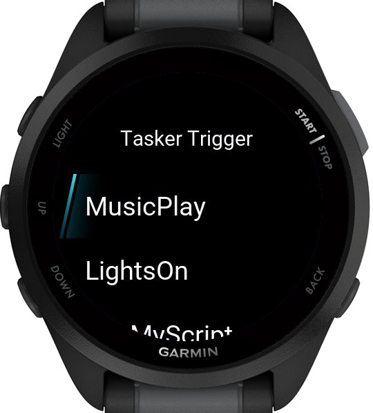

# Tasker Trigger

Trigger your existing Tasker tasks from your Garmin watch with a single tap.  
This app uses the [AutoNotification](https://play.google.com/store/apps/details?id=com.joaomgcd.autonotification) plugin on Android to bridge Garmin and Tasker.  

[Get the app on the Garmin Connect IQ Store](https://apps.garmin.com/en-US/apps/07e1de26-99e5-46e3-92d9-7d30f7f92bdd)

## Screenshot

## Features
- Trigger up to **20 Tasker tasks** directly from your Garmin device  
- Convenient, phone-free control  
- Completely **free and open source**  

## Requirements
This setup requires:
- [Tasker](https://play.google.com/store/apps/details?id=net.dinglisch.android.taskerm) on your Android device  
- [AutoNotification](https://play.google.com/store/apps/details?id=com.joaomgcd.autonotification) plugin for Tasker  
- A bit of setup time  

## Setup Guide
Full setup instructions are available here:  
[Tasker Trigger Setup Guide](https://chelseawinstone.com/tasker-trigger#setup-guide)

## Disclaimer
I am not the creator of, nor affiliated with, Tasker or AutoNotification.  
All credit for those apps goes to their respective developers.  
This app simply uses their functionality through the Tasker Trigger app for Garmin devices.

## Licence
This is free and unencumbered software released into the public domain.  

For more information, please refer to [The Unlicense](https://unlicense.org).